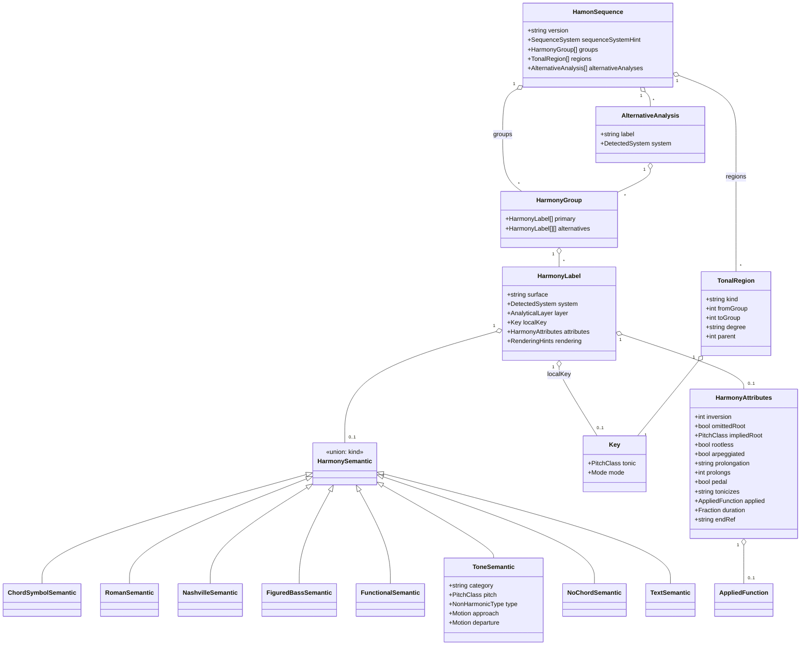

# HAMON — Analytical Layer (v0.2.0)

Up to v0.1.0, HAMON only described **harmony labels**: a chord symbol, a Roman
numeral, a Nashville number, a figured bass, a functional token, a no-chord, or
raw text. That tells you *what the chords are*, but it doesn't capture *a
harmonic analysis* of a piece.

The **analytical layer** (v0.2.0) fills that gap. It adds the structures a
harmonic-analysis project needs without breaking anything: every field
introduced here is **optional**, so a 0.1.0 document is still a valid 0.2.0
document. The canonical model lives in
[`grammar/hamon-schema.json`](../grammar/hamon-schema.json); the optional surface
syntax is defined in [`grammar/hamon.ebnf`](../grammar/hamon.ebnf).

What follows is the normative description of the layer, organized by analytical
capability.

---

## 0. Design principles

1. **The JSON model is the hub.** Some analyses don't fit on a single one-line
   surface string — a full multi-voice non-harmonic-tone reading, or two
   analysts' competing progressions. For those, the JSON structure is canonical;
   the surface syntax just covers the common inline cases.
2. **Additive and optional.** Analytical fields never change what an existing
   label means. A reader that ignores them still recovers the 0.1.0 reading.
3. **Layered, not flattened.** One time point can carry several *co-temporal*
   readings of the *same* sonority — a degree, a function, a bass figure, a key —
   each tagged with the analytical layer it expresses. Don't confuse this with
   *alternatives* (rival readings) or *simultaneity* (two chords at once).
4. **Spans are explicit.** Tonal regions, tonicizations, and alternative
   progressions all reference group indices, so an analysis scopes exactly onto
   the stretch of sequence it annotates.

| Concept | Same sonority? | Same time point? | Construct |
|---|---|---|---|
| **Layers** | yes | yes | `HarmonyLabel.layer` within one group's `primary` |
| **Simultaneity** | no | yes | several labels in one group's `primary` |
| **Alternatives (point)** | — | yes | `HarmonyGroup.alternatives` |
| **Alternatives (progression)** | — | a span | `HamonSequence.alternativeAnalyses` |
| **Regions** | — | a span | `HamonSequence.regions` |

---

## Model overview (UML)

Here is the canonical JSON model (`grammar/hamon-schema.json`) with the v0.2.0
analytical additions. `HarmonySemantic` is a discriminated union keyed on the
`kind` field; the analytical types hang off `HamonSequence` and `HarmonyLabel`.



---

## 1. Alternative harmonies — individual chords *and* whole progressions

### 1.1 Point alternatives (already in v0.1.0)

Two readings of a single time point go in the group-level alternatives. On the
surface you separate them with `|`; in JSON, each alternative is a list of labels:

```
@rn
V7 | bVII7        # primary reading V7, alternative reading bVII7 at the same beat
```

```json
{ "primary":      [ { "surface": "V7",   ... } ],
  "alternatives": [ [ { "surface": "bVII7", ... } ] ] }
```

### 1.2 Progression alternatives (new in v0.2.0)

A rival reading of a *whole span* — two analysts disagreeing, or a chord-symbol
reading set against a functional one — is a `HamonSequence.alternativeAnalyses[]`
entry. Each one carries an optional `label`, the `system` it's written in, the
`scope` it re-analyses (a group index range; leave it out to mean the whole
sequence), and its own `groups`.

```json
{
  "groups": [ /* primary reading: Dm7 | G7 | Cmaj7 */ ],
  "alternativeAnalyses": [
    {
      "label": "functional",
      "system": "fun",
      "scope": { "fromGroup": 0, "toGroup": 2 },
      "groups": [ /* S | D | T */ ]
    }
  ]
}
```

---

## 2. Tonal regions (*regiones tonales*) and 3. tonicizations

A **tonal region** is a span of groups governed by one local key. You model it
with `TonalRegion { key, kind, fromGroup, toGroup?, degree?, parent?, label? }`
on `HamonSequence.regions`.

`kind` tells the three cases apart:

- `key` / `region` — a stable tonal area;
- `tonicization` — a brief emphasis of a degree as a *local* tonic (a passing
  *región tonal*), usually set up by a secondary dominant;
- `modulation` — a confirmed change of key.

Regions can **nest**. A tonicization inside a region points back to its
enclosing region through `parent` and names the tonicized scale degree in
`degree`.

### Surface

A `@key:` directive opens a region. It runs over the groups that follow until
the next `@key:`, or until the sequence ends:

```
@rn
@key:C
I       vi      ii      V7      I
@key:G          # modulation to the dominant
ii      V7      I
```

A region defined relative to the prevailing key — a tonicization — takes a
degree instead of an absolute pitch:

```
@rn
@key:C
I
@key:V          # tonicize the dominant: a passing G-major region
V7/V    V       # i.e. D7 → G, heard locally as V7 → I
@key:C
I
```

```json
{
  "regions": [
    { "key": { "tonic": { "note": "C" }, "mode": "major" }, "kind": "key", "fromGroup": 0, "toGroup": 0 },
    { "key": { "tonic": { "note": "G" }, "mode": "major" }, "kind": "tonicization",
      "degree": "V", "parent": 0, "fromGroup": 1, "toGroup": 2 },
    { "key": { "tonic": { "note": "C" }, "mode": "major" }, "kind": "key", "fromGroup": 3 }
  ]
}
```

A label inside a tonicization can also carry its own `localKey`, so it describes
itself without a reader having to consult the region table.

---

## 4. Secondary dominants and 5. dominant of the dominant (V/V)

You can write these three ways, depending on the system you're in; all three
interoperate through the model.

1. **Roman numeral** — the applied notation that v0.1.0 already supported:
   `V7/V`, `viio7/ii`. `RomanSemantic.secondary` holds the target degree.
2. **Functional** — the `DD` token (Riemann's *Doppeldominante*) is the dominant
   of the dominant; a chain spells out the resolution: `DD->D->T`.
3. **Analytical attribute** — any label can declare an applied function through
   `HarmonyAttributes.applied { target, chain? }` and name the degree it
   tonicizes in `HarmonyAttributes.tonicizes`. Stacked secondaries (V/V/V) go in
   the `chain`, outermost first: `["V","V"]`.

### Surface

```
@rn
V7/V    V7    I            # secondary dominant of the dominant, then V, then I
```

```
@fun
DD -> D -> T               # Doppeldominante resolving through the dominant
```

The bracketed-attribute form attaches an applied reading to any label:

```
@cs
D7[of:V]   G7   C          # D7 functions as V/V in C
```

```json
{ "surface": "D7", "semantic": { "kind": "chordSymbol", "root": { "note": "D" }, "quality": "major", "seventh": "dom7" },
  "attributes": { "applied": { "target": "V" }, "tonicizes": "V" } }
```

Think of the secondary dominant as the surface event and the **tonicization
region** (§2/3) as its analytical span. The two work together: `applied` and
`tonicizes` annotate the chord, while a `TonalRegion` of `kind:"tonicization"`
annotates the passage.

> **Works on every chord root (fixed 2026-06-15).** `[of:…]` — and any bracketed
> attribute — now attaches to chord symbols whose root is followed by a letter,
> meaning flat roots and quality letters: `Bb7[of:V]`, `Db7[of:I]`, `Dm7[of:V]`,
> `Cmaj7[of:I]`, `Em7b5[of:ii]`. These used to lex as a single word, so the
> bracket got swallowed into the text run. The fix lets you express **tritone
> substitutions** as a flat-root dominant plus a target — e.g. `Db7[of:I]` =
> subV7/I. Parenthesised tension lists (`A7(b9,b13)`) also stay a single chord now.
> See the [`berklee-jazz`](../use-cases/berklee-jazz/) and
> [`jazzmus-berklee-dezrann`](../use-cases/jazzmus-berklee-dezrann/) use cases and
> [`berklee-jazz.md`](berklee-jazz.md).

---

## 6. Functional analysis with layers

A figured-bass-style functional analysis stacks several aligned readings under
each sonority. HAMON models this with **layered labels**: inside one
`HarmonyGroup.primary`, every label carries a distinct
`HarmonyLabel.layer ∈ {chord, degree, function, bass, melodic, key, tone}`.

A typical four-layer column under one chord:

| layer | content | example |
|---|---|---|
| `key` | the tonality | C major |
| `function` | tonal function | `D` (dominant) |
| `degree` | scale degree | `V7` |
| `bass` | bass / figured-bass | `6_5` (first inversion) |
| `melodic` | melodic / non-harmonic tone | see §7 |

### Surface

Prefix each reading with a layer tag (`<layer>:`) and join the readings with `,`
inside one group — they're co-temporal, not rival:

```
@auto
fn:D,rn:V7,fb:6-5
```

```json
{
  "primary": [
    { "surface": "D",  "layer": "function", "semantic": { "kind": "functional", "chain": ["D"] } },
    { "surface": "V7",  "layer": "degree",   "semantic": { "kind": "roman", "degree": "V", "tail": "7" } },
    { "surface": "6-5", "layer": "bass",     "semantic": { "kind": "figuredBass", "number": 6, "tail": "-5" } }
  ]
}
```

An `fb:` layer reads a number as a figured-bass figure rather than a Nashville
degree; an `fn:` layer reads a bare token as a tonal function, so `fn:D` is the
dominant even though `D` on its own would otherwise be a chord root.

The melodic/bass layer ties into **figured bass** (already a first-class
`FiguredBassSemantic`) and into the **note-level analysis** in §7.

---

## 7. Melodic note analysis — harmonic (HT) and non-harmonic (NHT) tones

A note-by-note melodic analysis sorts each tone into **harmonic** (a chord tone,
HT) or **non-harmonic** (a non-chord tone, NHT), and names the type of every
non-harmonic one. That's what the new `ToneSemantic` (`kind:"tone"`) captures, on
a `melodic` layer.

`ToneSemantic { category, pitch?, type?, metric?, approach?, departure?, voice? }`

`type` (`NonHarmonicType`) covers the standard catalogue:

| type | meaning |
|---|---|
| `chord-tone` | harmonic tone (HT) |
| `passing` | passing tone (use `metric` for accented/unaccented) |
| `neighbor` / `upper-neighbor` / `lower-neighbor` | neighbor (auxiliary) tone |
| `incomplete-neighbor` | incomplete neighbor |
| `suspension` | suspension |
| `retardation` | upward-resolving suspension |
| `appoggiatura` | appoggiatura (accented, approached by leap) |
| `escape` | escape tone (*échappée*) |
| `anticipation` | anticipation |
| `pedal` | pedal / organ point |
| `cambiata` | Fuxian *nota cambiata* / changing-note figure |
| `changing-tone` | changing tones (double neighbor) |

`approach` and `departure` (`Motion`) record how the melody moves in and out
(`step-up`, `leap-down`, `resolve`, …). That motion is what tells, say, an
appoggiatura (leap in, step out) apart from a passing tone (step in, step out).

### Surface

On a `melodic` layer, you write a tone as a pitch followed by a bracketed class:
`[HT]` for a harmonic tone, `[NHT:<type>]` for a non-harmonic one.

```
@auto
melodic:E[HT] , melodic:F[NHT:passing] , melodic:G[HT]
```

```json
[
  { "surface": "E", "layer": "melodic", "semantic": { "kind": "tone", "category": "harmonic",    "pitch": { "note": "E" }, "type": "chord-tone" } },
  { "surface": "F", "layer": "melodic", "semantic": { "kind": "tone", "category": "nonharmonic", "pitch": { "note": "F" }, "type": "passing", "metric": "unaccented", "approach": "step-up", "departure": "step-up" } },
  { "surface": "G", "layer": "melodic", "semantic": { "kind": "tone", "category": "harmonic",    "pitch": { "note": "G" }, "type": "chord-tone" } }
]
```

This is the structure interactive melodic-analysis tools target (for example the
Illescas analyzer, Phase 6.4): each analyzed note becomes a `ToneSemantic`, which
you can align with the chord layer that decides what counts as harmonic.

---

## 8. Modal harmony

Modal analysis needs two things: a key mode beyond major/minor, and the freedom
to spell the degrees that mode implies — `bVII` in mixolydian, `bII` in
phrygian, a reinterpreted major `IV`, the raised `vi` of dorian.

`Mode` adds the seven diatonic church modes alongside `major`/`minor`:
`ionian, dorian, phrygian, lydian, mixolydian, aeolian, locrian`. `major≡ionian`
and `minor≡aeolian`, and both spellings are allowed so a source can keep its own
vocabulary. A modal context is nothing more than a `Key`/`TonalRegion` with that
mode; the degrees are ordinary `RomanSemantic` labels measured against it.

### Surface

```
@rn
@key:D:dorian
i      IV     bVII   i          # dorian: major IV and subtonic bVII
```

```json
{ "regions": [ { "key": { "tonic": { "note": "D" }, "mode": "dorian" }, "kind": "region", "fromGroup": 0 } ] }
```

---

## 9. Omitted fundamentals (*fundamentales omitidas*)

There are two distinct claims here, and two attributes on `HarmonyAttributes` to
match:

- `rootless: true` — the **voicing** drops the root by convention (a jazz
  rootless voicing). A performance fact.
- `omittedRoot: true` (optionally with `impliedRoot`) — the **analysis** asserts
  an understood fundamental that never sounds (the classic incomplete dominant
  seventh, or a diminished seventh read as a rootless dominant minor ninth). An
  analytical claim.

The general "this degree is absent" case (omit3, no5) stays on
`ChordSymbolSemantic.omits`. `omittedRoot`/`impliedRoot` are reserved for the
*fundamental* specifically, because that's the one that carries analytical weight.

### Surface

`[no1]` marks the omitted root; `[rootless]` the voicing convention:

```
@rn
viio7[no1]      # diminished seventh read as a rootless V7(b9): root omitted
```

```json
{ "surface": "viio7", "semantic": { "kind": "roman", "degree": "vii", "tail": "o7" },
  "attributes": { "omittedRoot": true, "impliedRoot": { "note": "G" } } }
```

---

## 10. Arpeggiation / chord unfolding (*despliegue de los acordes*)

When a single harmony *unfolds* across time — an arpeggio, an Alberti bass, a
broken chord, or a broader prolongation — it's one analytical event spread over
several groups.

- `HarmonyAttributes.arpeggiated: true` — the chord is realized as an arpeggio.
- `HarmonyAttributes.prolongation ∈ {arpeggiation, pedal, neighbor, passing, prolongation}`
  classifies *how* a harmony elaborates a structural one (Schenkerian-style).
- `HarmonyAttributes.prolongs: <groupIndex>` points the elaborating harmony at
  the structural harmony it depends on.

### Surface

```
@cs
C[arp]          # C major realized as an arpeggio (despliegue)
```

```
@rn
I    V[ped]    I            # the V is a neighbor/pedal prolongation of I
```

```json
{ "surface": "C", "semantic": { "kind": "chordSymbol", "root": { "note": "C" }, "quality": "major" },
  "attributes": { "arpeggiated": true } }
```

A passing or neighbor chord that prolongs an earlier structural harmony points
to it by group index:

```json
{ "attributes": { "prolongation": "passing", "prolongs": 0 } }
```

---

## 10-bis. Extent (v0.4.1) — how long a reading lasts

A `Position` says where a harmony *starts*. `[dur:…]` and `[endref:…]` say where it
**ends**, and they sit on the **label**, not on the group.

That placement is the whole point. A group is one time point, shared by every reading
in it; the extent belongs to the reading. Two `alternatives` can hear the same passage
differently — one a `V` spanning two bars, the other `V` then `V7` — and only a
per-label extent can hold both:

```
@rn
@meter:4/4
m:1,ts:1,V[dur:8]|V[dur:4]      # two readings, same onset, different segmentation
```

| Surface | Field | Meaning |
|---|---|---|
| `[dur:3/4]` | `HarmonyAttributes.duration` | extent in **quarter notes** — the same unit as `Position.time`. A fraction (`3/4`), an integer (`2`) or a decimal (`1.5`). |
| `[dur:1.85s]` | `HarmonyAttributes.durationSeconds` | extent in **seconds** (v0.5) — the same clock as `Position.seconds`. One key, an optional suffix: the extent inherits the clock the source stated. |
| `[endref:note-12]` | `HarmonyAttributes.endRef` | the score object it ends on (MEI `@endid`), the structural counterpart of `ref:` |

```json
{ "surface": "Cmaj7", "semantic": { "kind": "chordSymbol", "root": { "note": "C" }, "seventh": "maj7" },
  "attributes": { "duration": { "numerator": 4, "denominator": 1 }, "endRef": "note-12" } }
```

**Only what a source stated.** Absent does not mean zero, it means *unknown*. The rule
that a harmony runs until the next group is a **computation**, and it is never written
into the data — a derived extent stored as if it were annotated is indistinguishable
from one an editor asserted, and that is how a lossy conversion comes to look lossless.
An extent that cannot be read (`[dur:soon]`) is ignored rather than guessed; the surface
still round-trips.

Where it comes from today, in quarter notes: Dezrann `duration`, DCML expanded
`duration_qb`, the AugmentedNet dialect of the DiLeMMa pitch arrays (`a_duration`), and
MEI `@endid`. **Harte and JAMS state theirs in seconds** (Harte's `end`, JAMS's
`duration`), which since v0.5 is read into `durationSeconds` rather than dropped. The two
are never converted into each other — crossing the clocks needs a tempo map the label
stream does not have. See
[`positions.md`](positions.md#the-two-clocks-s-physical-time-v05).

---

## 11. Chord-scales (v0.3.0) — jazz/Berklee

This records the recommended scale or scales for a chord or a region
(chord-scale theory). There are two places to anchor it:

- **Per chord** — one or more `[scale:NAME]` attributes → `HarmonyAttributes.scales`
  (a list of `ScaleSpec`). Repeat the bracket to give alternatives.
- **Per region** — a `@scale:NAME[,NAME…]` directive that binds to the region
  opened by the preceding `@key:` → `TonalRegion.scales`.

`NAME` is an open vocabulary: the church modes plus `altered`, `lydian-dominant`,
`locrian-natural-2`, `whole-tone`, `diminished-hw` / `diminished-wh`,
`harmonic-minor`, `melodic-minor`, `bebop-dominant`, `blues`, and so on. A
`ScaleSpec` can also carry an explicit `tonic` (when it differs from the chord
root or region key) and explicit `pitches` for non-standard scales.

### Surface

```
@key:C
@scale:major,lydian
Dm7[scale:dorian]
G7[scale:mixolydian][scale:altered]
Cmaj7[scale:lydian]
```

```json
{ "surface": "G7[scale:mixolydian][scale:altered]",
  "semantic": { "kind": "chordSymbol", "root": { "note": "G" }, "quality": "major", "seventh": "dom7" },
  "attributes": { "scales": [ { "name": "mixolydian" }, { "name": "altered" } ] } }
```

A per-chord scale takes the chord root as its tonic unless `tonic` says
otherwise; a per-region scale takes the region key. See
[`berklee-jazz.md`](berklee-jazz.md) for the jazz/Berklee workflow.

---

## Mapping summary (schema `$defs`)

| Capability | Schema `$def` / field |
|---|---|
| Point alternatives | `HarmonyGroup.alternatives` |
| Progression alternatives | `HamonSequence.alternativeAnalyses` → `AlternativeAnalysis` |
| Tonal regions / modulation | `HamonSequence.regions` → `TonalRegion` (`kind: key\|region\|modulation`) |
| Tonicizations | `TonalRegion` (`kind: tonicization`, `degree`, `parent`) + `HarmonyLabel.localKey` |
| Secondary dominants / V/V | `RomanSemantic.secondary`, `FunctionalSemantic.chain` (`DD`), `HarmonyAttributes.applied`/`tonicizes` |
| Layered functional analysis | `HarmonyLabel.layer` (`AnalyticalLayer`) |
| Melodic HT/NHT analysis | `ToneSemantic` + `NonHarmonicType` + `Motion` |
| Modal harmony | `Mode` (church modes) on `Key` / `TonalRegion` |
| Omitted fundamentals | `HarmonyAttributes.omittedRoot` / `impliedRoot` / `rootless` |
| Arpeggiation / unfolding | `HarmonyAttributes.arpeggiated` / `prolongation` / `prolongs` |

## Surface summary (EBNF rules)

| Surface | EBNF rule |
|---|---|
| `@key:C`, `@key:A:minor`, `@key:D:dorian`, `@key:V` | `keyDecl`, `keyTarget`, `modeSuffix` |
| `fn:D`, `rn:V7`, `fb:65`, `melodic:E` | `layerTag`, `layerName` |
| `[no1]`, `[arp]`, `[ped]`, `[inv:1]`, `[of:V]`, `[HT]`, `[NHT:passing]` | `analysisAttr` |
| `V7/V`, `viio7/ii` | `romanNumeral` / `rnSecondary` (v0.1.0) |
| `DD->D->T` | `functionalHarmony` (v0.1.0) |

## Implementation status

The analytical layer is **wired end-to-end in the reference implementation** —
every surface form in this document parses from `.hamon` text into the AST.

- **Canonical model** (`grammar/hamon-schema.json`, v0.2.0) — complete.
- **Typed AST** (`hamonpy/hamonpy/ast.py`) — complete.
- **Grammar + reference parser** (`grammar/hamon.ebnf`, `antlr/*.g4`, the
  generated Python parser, visitor and normalizer) — complete. The
  `keyDecl` region directive, `layerTag`, bracketed `analysisAttr`, and HT/NHT
  tones all parse into `regions`, `layer`, `attributes`, and `ToneSemantic`.
  Tonicization tonics are computed from the parent key (`@key:V` in C → G).
- **Tests** — a surface-parse suite `hamonpy/tests/test_analysis_parse.py` (plus
  the `conformance/` golden corpus, which includes analytical labels); a model
  suite `hamonpy/tests/test_analysis.py`.
- **Example fixtures** — `fixtures/analysis/` (canonical-model JSON).
