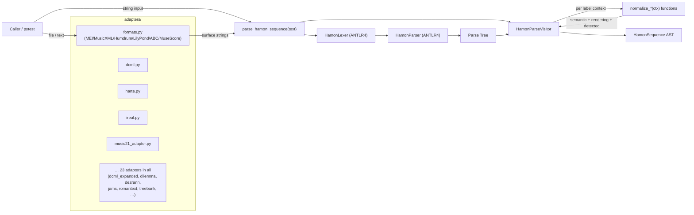
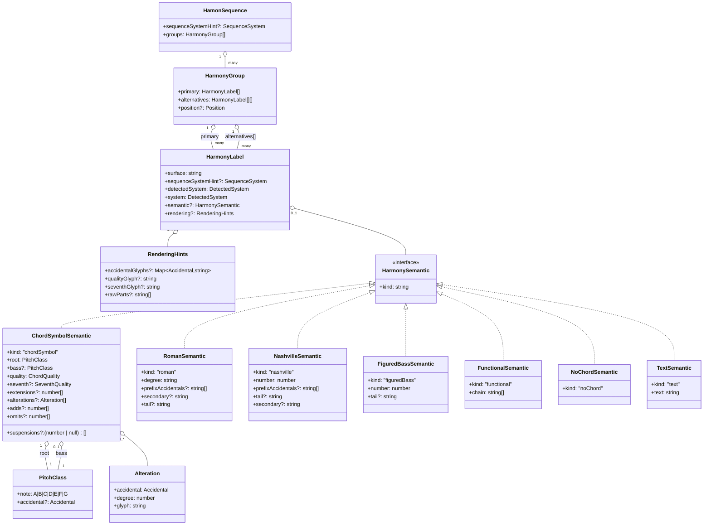
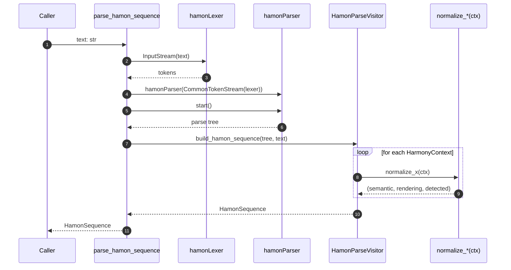
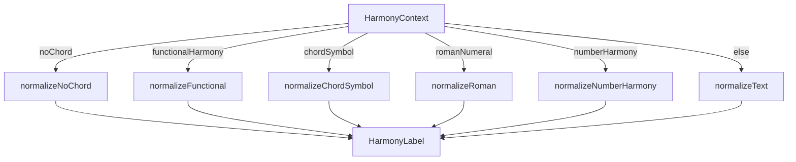
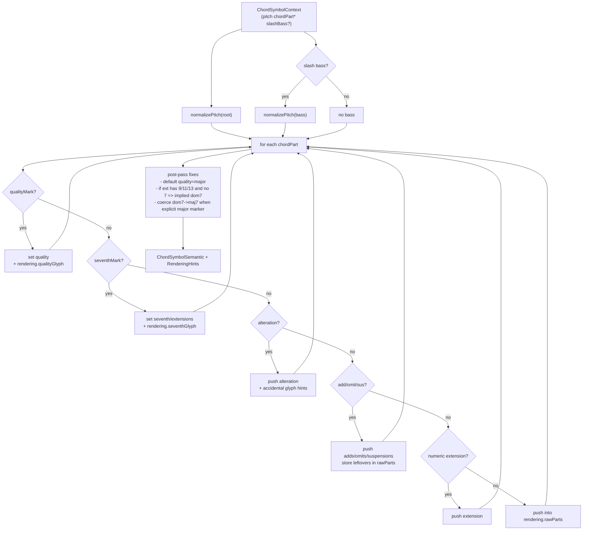
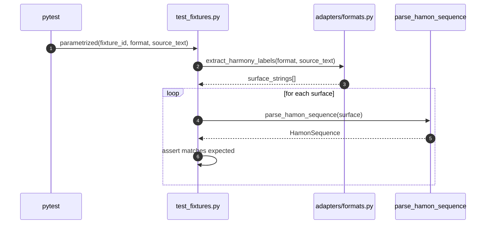

# HAMON Architecture (Mermaid UML)

Mermaid diagrams of HAMON's architecture, as implemented in **hamonpy** (the Python
reference implementation).

> Conventions
>
> - **Surface-first**: every label keeps the exact substring as written.
> - `sequenceSystemHint` comes from the optional `@cs/@rn/@auto/...` prefix line.
> - `detectedSystem` is what the grammar and heuristics matched.
> - `system` is the final system, once the hint has been applied.

---

## 1) Package / component overview

---

## 2) Core data model (AST) — class diagram

The core data model (`hamonpy/hamonpy/ast.py`).

---

## 3) Parsing pipeline — sequence diagram

Entry point: `parse_hamon_sequence(text)` → `HamonSequence`.

---

## 4) Visitor decision logic (label family dispatch)

The **parser** first recognizes one of these label families:
`noChord | functionalHarmony | chordSymbol | romanNumeral | numberHarmony | textLabel`.

The **visitor** mirrors that dispatch and calls the matching normalizer.

---

## 5) Chord symbol normalization — activity diagram

The chord symbol normalizer is deliberately permissive. It parses the pieces it recognizes and stashes whatever's left in `rendering.rawParts`.

---

## 6) Fixture test pipeline

---

## 7) Extension notes

### Roman / number harmony normalization
- `normalizeRoman()` currently keeps `tail` as a surface string. Split it into inversion/figures/secondary relationships when you're ready.
- `normalizeNumberHarmony()` uses a **hyphen-digit** heuristic (`6-5`) to decide figured bass. Swap in a richer rule set when you need one.

### Round-trip rendering
- `RenderingHints` records the explicit "how it was printed" choices (`b` vs. `♭`, `maj` vs. `Δ`).
- `surface` is always preserved as-is. Semantics and rendering stay in separate layers.
