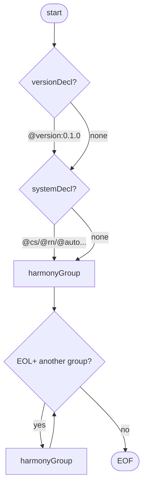
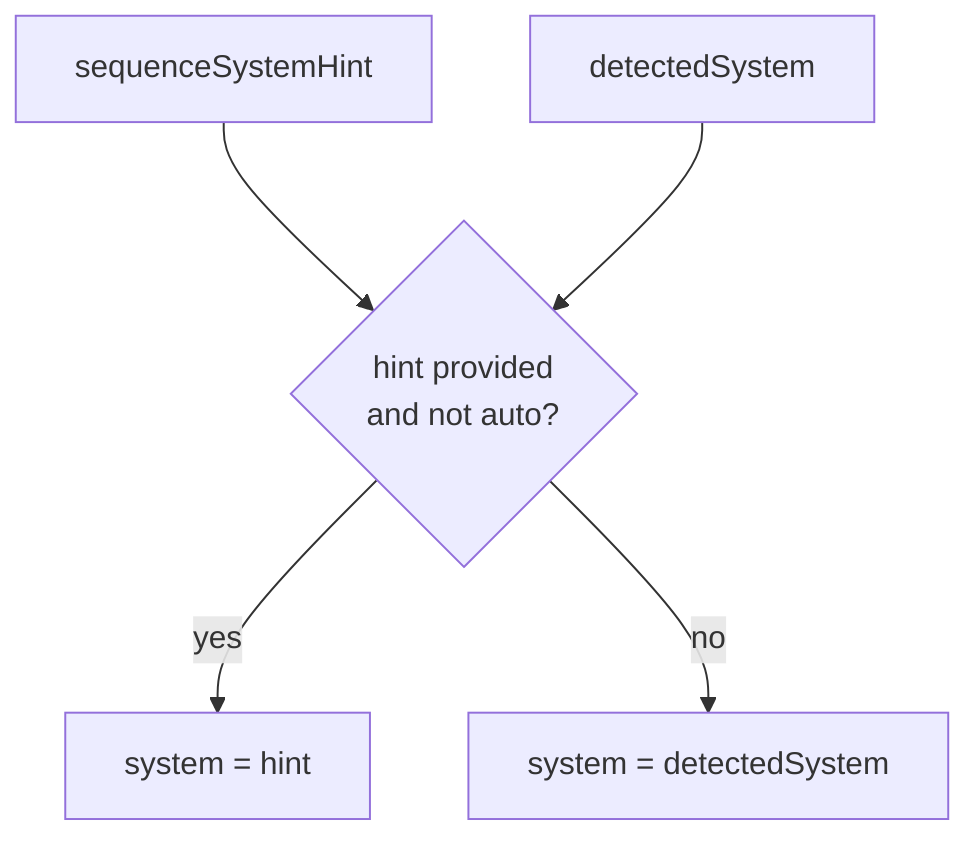
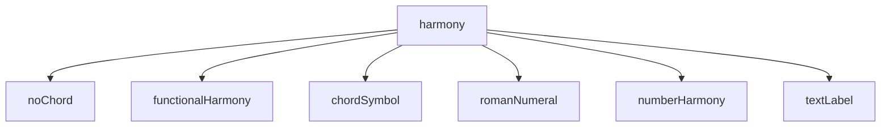
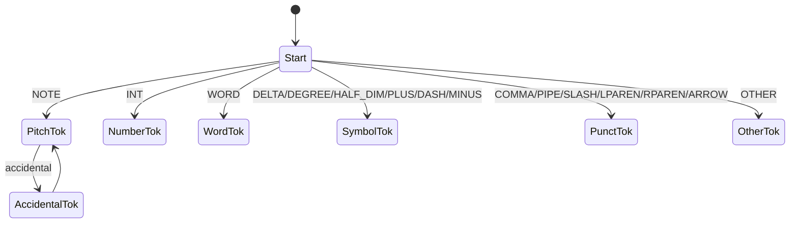
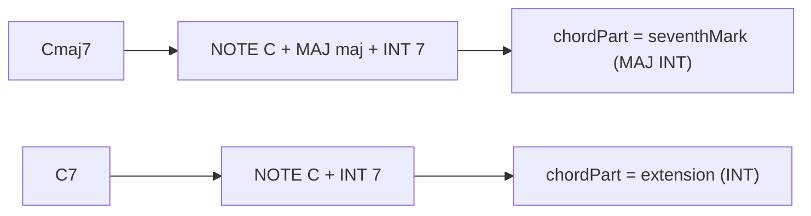

# HAMON Grammar Internals (Mermaid)

The **HAMON surface-first grammar**, as implemented in:

- `antlr/hamonLexer.g4`
- `antlr/hamonParser.g4`
- `grammar/hamon.ebnf` (RR-friendly EBNF mirror; railroad diagrams at `documentation/railroad/index.html`)

The goal is to parse **real-world written harmony labels**, keep the exact glyphs, and leave any ambiguity for the normalizers and heuristics to resolve later.

---

## 1) Top-level structure

A *sequence* may open with an optional version declaration and/or system hint, then carries one or more lines. Each line is a **harmonyGroup**.

- `,` separates labels inside a list.
- `|` separates alternatives.
- Newlines separate groups.

### Grammar sketch
- `start  : versionDecl? (EOL)* systemDecl? (EOL)* harmonyGroup ( (EOL)+ harmonyGroup )* (EOL)* EOF`
- `versionDecl : VERSION_DECL`  — single token matching `@version:M.m.p`
- `harmonyGroup : harmonyList ( '|' harmonyList )*`
- `harmonyList  : harmony ( ',' harmony )*`

---

## 2) Version declaration and system hint

### Version (`@version:<semver>`)

`versionDecl : VERSION_DECL`

`VERSION_DECL` is a single lexer token matching `'@version:' [0-9]+ ('.' [0-9]+)*`. Longest-match makes it win over `AT` (`'@'`). It maps to `HamonSequence.version` (a string). Example: `@version:0.1.0`.

### System hint (`@cs/@rn/...`) and system resolution

`systemDecl : '@' SYSTEM_ID`

Supported system IDs: `auto`, `cs`, `rn`, `ns`, `fb`, `fun`, `text`

Semantics:
- The parser still detects a label family on its own.
- The visitor then resolves `system`:
  - `system = detectedSystem` when there's no hint or the hint is `@auto`
  - otherwise `system = hint` (and `detectedSystem` is kept alongside it)

---

## 3) Label families (the `harmony` rule)

`harmony` is an ordered choice:

1. `noChord`
2. `functionalHarmony`
3. `chordSymbol`
4. `romanNumeral`
5. `numberHarmony`
6. `textLabel`

The order matters whenever a label could match more than one family — the first match wins.

---

## 4) Lexer overview (tokenization)

Key tokens (selected):

- Separators: `COMMA ','`, `PIPE '|'`, `EOL`, `WS` (skipped)
- Directives: `VERSION_DECL '@version:M.m.p'` (whole version string as one token), `AT '@'`, `SYSTEM_ID` (`auto|cs|rn|...`)
- Punctuation: `LPAREN '('`, `RPAREN ')'`, `SLASH '/'`, `DASH '-'`, `ARROW '->'`
- Pitch: `NOTE [A-G]` and accidentals (`SHARP`, `FLAT`, `DBLSHARP`, `DBLFLAT`, `NATURAL`)
- Quality-ish words: `MAJ`, `MIN`, `DIM`, `AUG`, `ADD`, `OMIT`, `NO`, `SUS`
- Symbols: `DELTA 'Δ'`, `DEGREE '°'`, `HALF_DIM 'ø'`, `PLUS '+'`, `MINUS '−'`
- Roman numeral token: `ROMAN` (common roman strings)
- Numbers: `INT [0-9]+`
- Fallbacks: `WORD [A-Za-z]+`, `OTHER .`

### `DASH '-'` vs `MINUS '−'`
- ASCII `-` is `DASH`, used structurally (as in figured-bass `6-5`).
- Unicode minus `−` tokenizes separately as `MINUS` and counts as a quality marker (minor).

### Maximal munch and Roman-with-quality
Under ANTLR's maximal-munch rule, `WORD` matches `iim` (3 chars) before `ROMAN` can match `ii` (2 chars). To recover, the normalizer has a fallback regex, `_ROMAN_WITH_QUALITY_RE`, that catches patterns like `iim7` or `Vm7` once the `textLabel` path has been taken.

---

## 5) Chord symbols

Rule:

- `chordSymbol : pitch chordPart* slashBass?`
- `pitch : NOTE accidental?`
- `slashBass : '/' pitch`

### `chordPart` and losslessness

`chordPart` is permissive. Anything it doesn't recognize is still kept as `WORD`/`OTHER`, and later lands in `rendering.rawParts`.

#### Disambiguation: `maj7` vs `maj + 7`

To keep these apart, `chordPart` tries `seventhMark` **before** `qualityMark`:

- `seventhMark : DELTA INT? | MAJ INT`
- `qualityMark : MAJ | MIN | DIM | AUG | DEGREE | HALF_DIM | PLUS | DASH | MINUS`

The result:
- `Cmaj7` tokenizes as `NOTE MAJ INT`, and `MAJ INT` parses as `seventhMark`.
- `C7` parses as `extension`.

### Parentheses
`parenGroup : '(' parenItem* ')'`

`parenItem` covers `alteration`, `seventhMark`, `INT`, `WORD`, `qualityMark`, `SLASH`, `DASH`, `OTHER`.

That's what lets surface forms like these through:
- `C7(#11)`
- `C(maj7)`
- `C7(b9 #11)`

---

## 6) Roman numerals

Rule:

- `romanNumeral : rnAccidental* ROMAN rnTail* rnSecondary?`
- `rnSecondary : '/' rnAccidental* ROMAN`

Roman numerals are *surface-first*: the grammar accepts tails (figures, quality-ish markers, or other characters) without fully interpreting them yet.

Examples:
- `bII65/V`
- `#iv°7`

---

## 7) Number harmony (Nashville vs figured bass)

Rule:

- `numberHarmony : rnAccidental* INT numberTail* numberSecondary?`
- `numberTail` contains a **structural figured-bass signal**: `(DASH INT)`

So `6-5` gets parsed structurally, and the normalizer later reuses that same signal (hyphen-digit) to decide `fb` vs. `ns`.

Examples:
- Nashville-ish: `b7`, `1m`, `5/7`
- Figured-bass-ish: `6-5`, `4-3`, `7-6`

---

## 8) Text labels

Rule:

- `textLabel : QUOTED_TEXT | rawRun`
- `rawRun : rawAtom+`

This is the catch-all that keeps a label **lossless** when it matches none of the known families. The normalizer then runs a few more heuristics (including `_ROMAN_WITH_QUALITY_RE`) before it settles on `TextSemantic`.

---

## 9) Practical notes for evolution

- Adding new systems (more RN flavors, say)? Do it in two steps:
  1) capture a permissive surface parse in ANTLR,
  2) push the semantic tightening into the normalizers.

- Keep tokens ordered so nothing surprises you:
  - specific tokens (`MAJ`, `ROMAN`) must come before the generic ones (`WORD`, `OTHER`).

- After editing `antlr/*.g4` or `grammar/hamon.ebnf`, run:
  - `./hamonpy/antlr.sh` to regenerate the Python parsers
  - `./tools/scripts/railroad.sh` to regenerate railroad diagrams
  - (The git pre-commit hook automates the railroad step.)
